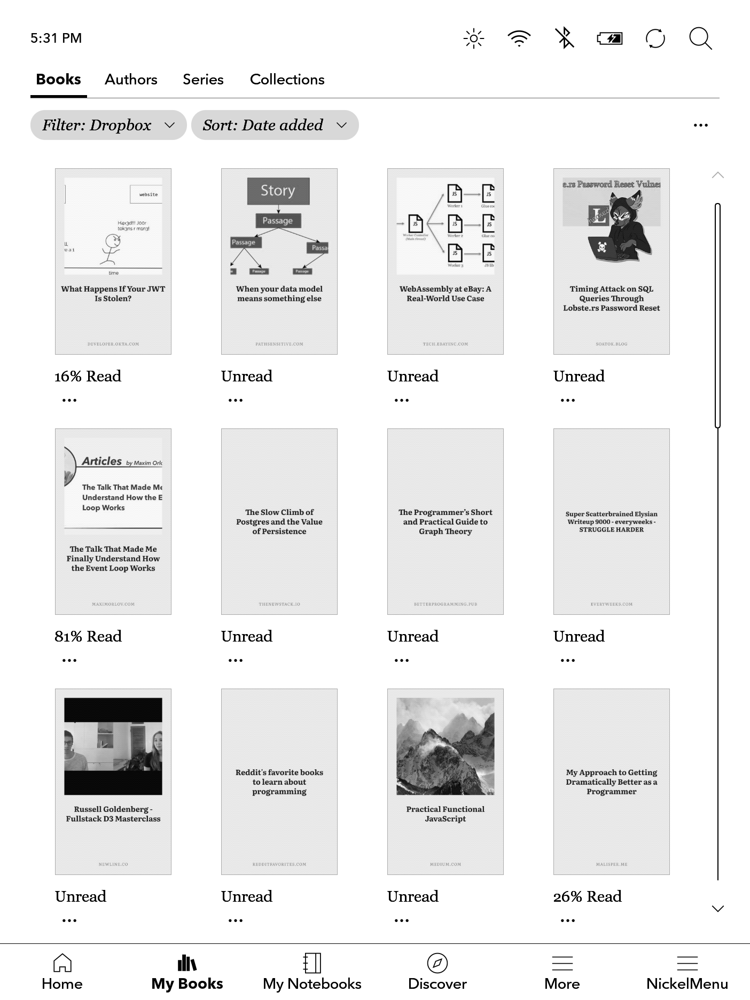
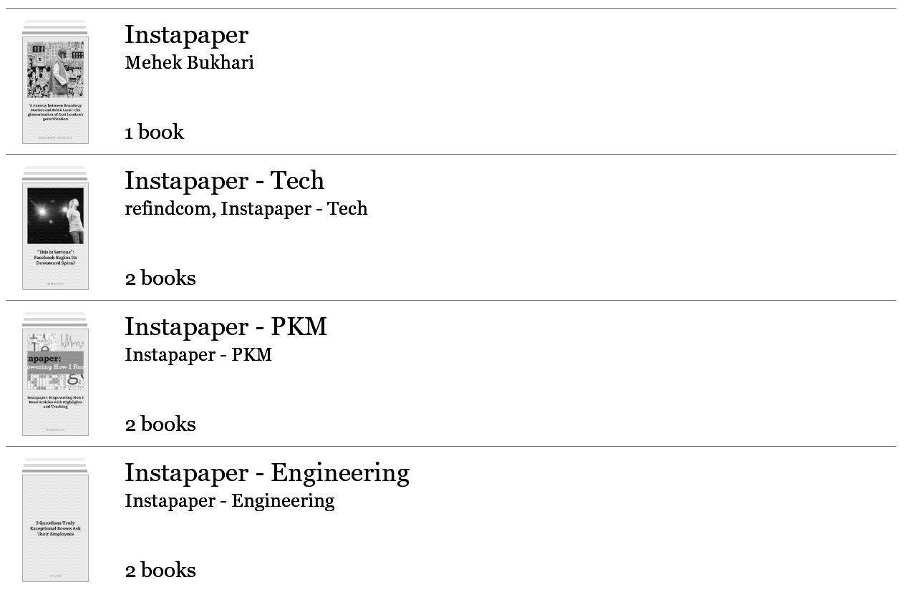

# InstaKobo

[](https://github.com/voidberg/instakobo/actions/workflows/ci.yml)
[](./LICENSE)

Read your [Instapaper](https://www.instapaper.com) articles on your Kobo device and sync your
reading progress and highlights back.

It turns each article into a Kobo `kepub` with [Quarto](https://github.com/voidberg/quarto), and
reads the device's own SQLite database to push progress and highlights back to Instapaper. You sync
those articles to the device yourself, via sideloading or one of the integrations like Dropbox or
Google Drive.

I am currently working on a more seamless experience in the form of an application that can be
installed directly on your device, paired with a self-hosted app, that can automatically download
the articles and sync the highlights. There is also a version for the Remarkable tablets in the
works.

## Why not use the built-in Instapaper integration?

This started back when Pocket was the only official way to read saved articles on a Kobo. After
Pocket shut down, Rakuten added built-in Instapaper support. It works well for most people, but for
me it still misses a few things I rely on: there's no support for folders, tags, or highlighting,
and images are missing from many articles.

## Features

- Generate a `kepub` (or plain `EPUB`) for every saved article, organised by folder.
- Adds series metadata so articles group under the **Series** tab (requires
  [NickelSeries](https://github.com/pgaskin/NickelSeries)).
- **No external `kepubify`**: Kobo conversion is built in via Quarto.
- Sync reading progress and highlights back to Instapaper.
- Optionally archive finished articles and remove them from the device (opt-in; off by default).
- Ships as one compiled binary you can drop anywhere.

## Screenshots

| Articles on Kobo                                                 | A generated cover                                   |
| ---------------------------------------------------------------- | --------------------------------------------------- |
|  |  |

## How I use it

My current workflow uses Dropbox:

- Generate a `kepub` for each article into Rakuten's Dropbox folder
  (`Dropbox/Apps/Rakuten Kobo/Instapaper`).
- Sync all articles, or some, on the eReader.
- Use the **Dropbox** filter (or, with NickelSeries, the **Series** tab) to find your synced
  articles.
- Read on the device, add highlights.
- Sync reading progress and highlights back to Instapaper, which then flow into Readwise and out to
  a PKM tool.
- With `--archive --delete`, finished articles are archived on Instapaper and removed from the
  device.

## Organising the articles on the e-reader

- **Stock firmware:** I recommend using the Dropbox or Google Drive integration just for this, as it
  allows you to use the library's built-in filter (e.g. "Dropbox") to view just your articles.
- **With [NickelSeries](https://github.com/pgaskin/NickelSeries):** every article carries series
  metadata, so your Instapaper folders show up under the library's **Series** tab.



## Install

Grab a binary for your platform from the
[releases page](https://github.com/voidberg/instakobo/releases) - it's self-contained, with no Deno
required. To run from source instead, install [Deno](https://deno.com) and use the tasks:

```sh
deno task dev --help   # run from a checkout
deno task compile      # build your own binary for the current platform
```

### macOS

The binaries are ad-hoc signed but not yet notarized, so macOS Gatekeeper blocks them on first
launch with "cannot be opened because the developer cannot be verified". Clear the quarantine flag
after downloading:

```sh
xattr -d com.apple.quarantine ./instakobo
```

Or, in Finder, right-click the binary and choose Open the first time. (Notarization is planned,
which will remove this step.)

## Getting started

1. Instapaper's API needs an OAuth consumer key and secret. Register an application on the
   [Instapaper developers page](https://www.instapaper.com/developers). You can use any title and
   description, for example:
   - **Title:** instakobo for {your name}
   - **Description:** Personal command-line tool that converts my saved Instapaper articles into
     EPUB/kepub files for my Kobo e-reader, and syncs reading progress and highlights back to
     Instapaper. See https://github.com/voidberg/instakobo.
2. Run `instakobo setup` and paste in the required values when prompted. It verifies them with
   Instapaper and saves your consumer key/secret plus an **access token** (not your password) to
   `~/.config/instakobo/config` (or `$XDG_CONFIG_HOME/instakobo/config`), owner-readable only.
   Running any command with no saved credentials will offer setup automatically.

   ```sh
   instakobo setup
   ```

   If you already have the values, you can write that config file yourself instead - it's a simple
   `KEY=VALUE` file:

   ```sh
   INSTAPAPER_KEY=your-consumer-key
   INSTAPAPER_SECRET=your-consumer-secret
   INSTAPAPER_TOKEN=your-access-token
   INSTAPAPER_TOKEN_SECRET=your-access-token-secret
   ```

   The same keys also work as environment variables or a `.env` file in the working directory, and
   each has an `--instapaper-*` flag. Precedence is flags → environment → saved config. In place of
   a token you may supply `INSTAPAPER_USERNAME`/`INSTAPAPER_PASSWORD`, which are exchanged for a
   token on each run.

3. Generate articles into your sync folder, then sync after reading:

   ```sh
   instakobo generate --out-dir ~/Dropbox/Apps/Rakuten\ Kobo/Instapaper
   # ... read on the device, highlight, then plug it in ...
   instakobo sync --kobo-dir /Volumes/KOBOeReader
   # add --archive --delete --out-dir ~/Dropbox/Apps/Rakuten\ Kobo/Instapaper to also clean up finished articles
   ```

## Usage

```
instakobo <command> [options]

COMMANDS
  setup       Save your Instapaper credentials (run this first)
  generate    Build (K)EPUBs from your Instapaper articles
  sync        Push reading progress and highlights back to Instapaper
```

### `generate`

| Option          | Default   | Description                                                                |
| --------------- | --------- | -------------------------------------------------------------------------- |
| `-o, --out-dir` | `./kepub` | Output directory (one subfolder per Instapaper folder).                    |
| `--skip-kepub`  | `false`   | Emit plain EPUB instead of Kobo kepub.                                     |
| `--skip-meta`   | `false`   | Don't fetch each article's page for cover art and byline (faster/offline). |
| `--force`       | `false`   | Re-generate even if the output file already exists.                        |
| `--limit <n>`   | `500`     | Max articles per folder (the Instapaper API maximum).                      |

### `sync`

| Option          | Default                 | Description                                                         |
| --------------- | ----------------------- | ------------------------------------------------------------------- |
| `--kobo-dir`    | `/Volumes/KOBOeReader/` | Mounted Kobo path.                                                  |
| `-o, --out-dir` | _(none)_                | (K)EPUB dir; finished files are removed here too (with `--delete`). |
| `--archive`     | `false`                 | Also archive finished articles on Instapaper.                       |
| `--delete`      | `false`                 | Also delete finished articles from the device (and `--out-dir`).    |

By default `sync` only updates reading progress and uploads highlights; it never archives or
deletes.

Both commands also accept the `--instapaper-*` credential overrides described under
[Getting started](#getting-started) and `-h, --help`.

## How it works

- **Articles** come straight from the Instapaper Full API (OAuth 1.0a / xAuth, implemented with Web
  Crypto - no third-party SDK). Instapaper exposes no byline or cover, so (unless `--skip-meta`)
  instakobo fetches each article's page once and reads its Open Graph image plus author metadata,
  falling back to a generic author. A designed cover with the title and source is composited on top.
- **EPUB/kepub** generation is done by [`@voidberg/quarto`](https://github.com/voidberg/quarto),
  which produces valid EPUB3 with no table of contents and the Kobo `koboSpan` markup.
- **Progress & highlights** are read from the device's `KoboReader.sqlite`. Kobo writes it in WAL
  mode; instakobo reads a private copy so the device database is never touched.
- The filename scheme (`title-ipaper[-folder]-id.kepub.epub`) lets `sync` map a file on the device
  back to its Instapaper bookmark.

### Limitations

- Instapaper's highlight API stores only text and position, so Kobo annotations (notes attached to a
  highlight) aren't synced.
- `--limit` caps at 500; Instapaper's list endpoint returns at most the 500 most recent.

## Development

```sh
git config core.hooksPath .githooks  # one-time: enable the pre-push test gate
deno task test          # unit tests (no credentials needed)
deno task check         # type-check (needs @voidberg/quarto published, or use deno.local.json)
deno task compile       # build a binary for the current platform
deno fmt && deno lint
```

The `pre-push` hook (in `.githooks/`) runs `deno task check`, `deno lint`, and `deno task test`
before a push.

`deno.local.json` resolves [`quarto`](https://github.com/voidberg/quarto) from a sibling `../quarto`
source checkout instead of JSR, for developing the two repos in tandem. It needs that checkout to
exist; without it, use the normal `deno task` commands (which uses the currently published quarto).

```sh
deno task --config deno.local.json check
deno task --config deno.local.json test
```

## License

[MIT](./LICENSE) © Alexandru Badiu
